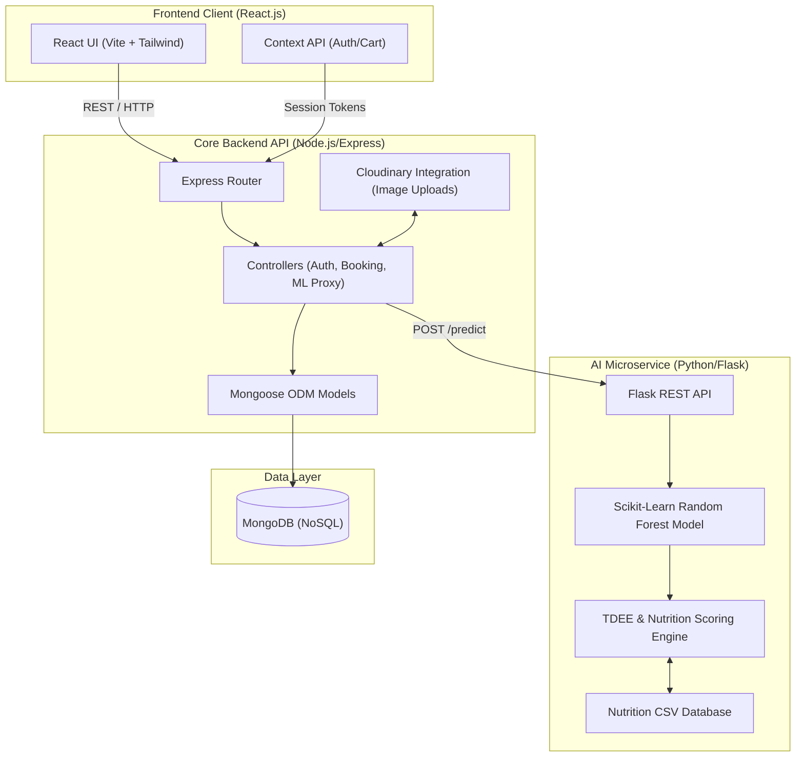
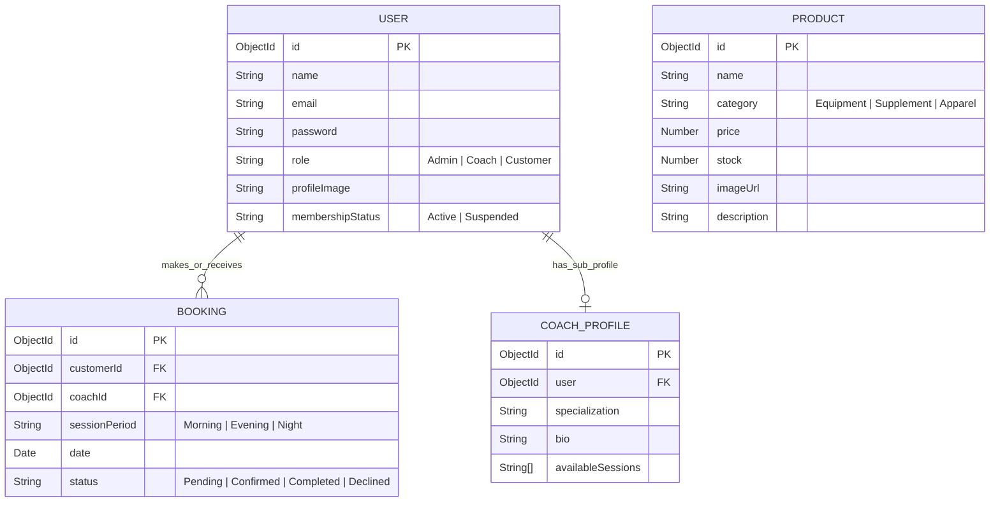
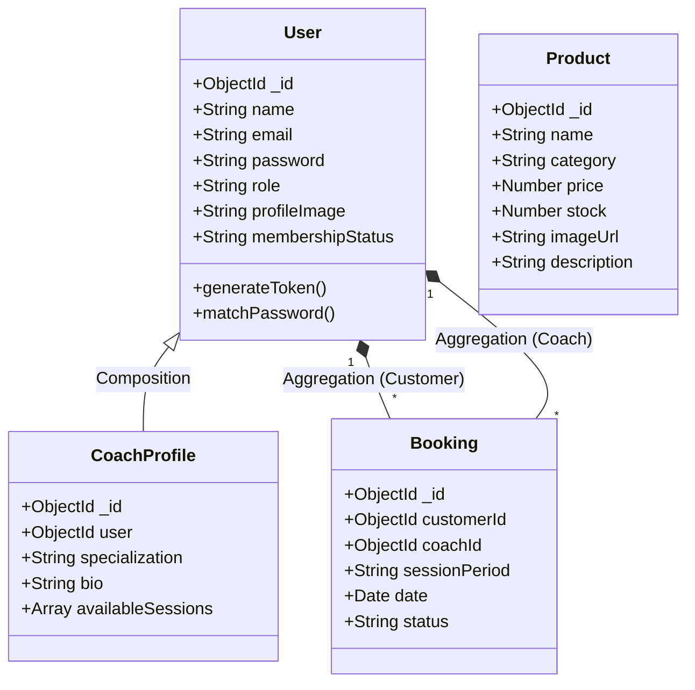
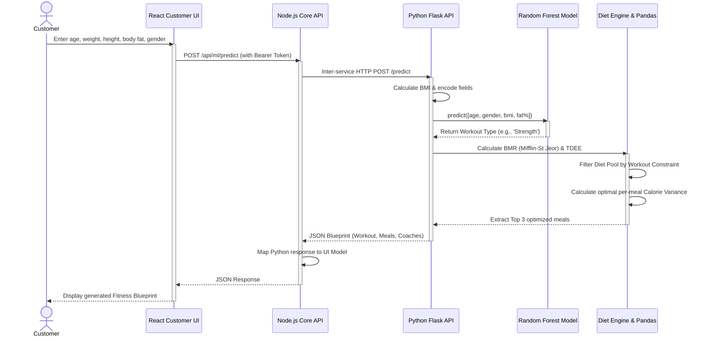

# 🏋️ Gym Next Gen: AI-Powered Fitness & Facility Management Platform


**Gym Next Gen** is a comprehensive, modern web application designed to revolutionize fitness center management and the member experience. It seamlessly integrates a robust facility management system with an advanced **Artificial Intelligence (AI) Oracle** that acts as a personalized, virtual personal trainer and nutritionist, generating bespoke fitness blueprints for members.

---

## 📑 Table of Contents

1. [Development Methodology & Lifecycle](#-development-methodology--lifecycle)
2. [System Architecture](#-system-architecture)
3. [Entity Relationship Diagram (ERD)](#-entity-relationship-diagram-erd)
4. [UML Class Diagram](#-uml-class-diagram)
5. [Sequence Diagram: AI Blueprint Generation](#-sequence-diagram-ai-blueprint-generation)
6. [Core Features & Functions](#-core-features--functions)
7. [Machine Learning Engine: Deep Dive](#-machine-learning-engine-deep-dive)
8. [Technologies & Frameworks](#-technologies--frameworks)
9. [Software Design Patterns](#-software-design-patterns)
10. [Running the Application locally](#-running-the-application-locally)

---

## 🔄 Development Methodology & Lifecycle

**Gym Next Gen** was developed utilizing the **Agile Methodology**, specifically adhering to **Scrum** principles. Agile is the industry standard for modern, multi-tiered modular applications like the MERN stack coupled with Python microservices.

It was chosen for its iterative nature, enabling rapid prototyping and continuous feedback mapping.

### 1. Iterative & Incremental Development (Sprints)

The project lifecycle was divided into focused phases:

- **Backend Foundations:** Initiating the database schemas (MongoDB), establishing RBAC via JWT, and defining Express.js routing structures.
- **AI Microservice:** Concurrently scaffolding the Python Flask environment, training the Scikit-Learn `Random Forest` models, and constructing the Pandas nutrition logic.
- **Frontend Consumption:** Incrementally building the React interface using **Component-Driven Development (CDD)**, allowing smaller, isolated components (e.g., `Navbar`, `ImageUpload`) to be assembled into complex dashboard ecosystems.

### 2. Component-Driven Development (CDD)

For the React frontend, UI elements were built from the "bottom-up". This ensures that discrete pieces of the interface are reusable, rigidly tested, and maintain visual consistency (via TailwindCSS) before being imported into core pages like the `CustomerDashboard` or `AIOracle`.

### 3. Continuous Integration & Decoupled Architecture

Because the system employs a **Microservices Architecture** (separating the Node.js API from the Python ML API), Agile facilitates independent lifecycle management:

- **Independent Scaling & Deployment:** The Machine Learning endpoint can be fine-tuned, re-trained, and redeployed entirely independently of the core React/Node ecosystem.
- **Adaptability:** Modifications to the ML prediction pool or frontend layout can be executed rapidly without creating blocking dependencies across the entire project pipeline.

---

## 🏗 System Architecture

Gym Next Gen uses a **Microservice-oriented architecture** consisting of three main tiers: a scalable frontend application, a centralized Node.js backend acting as an API Gateway/Core Service, and a dedicated Python ML Microservice for heavy computational inference.



---

## 🗄 Entity Relationship Diagram (ERD)

The following diagram illustrates the data schema and relationships mapped out in MongoDB via Mongoose.



---

## 🧩 UML Class Diagram

This class diagram depicts the core backend architectural structure, showing the Mongoose schemas and their relationships at an application level.



---

## 🔄 Sequence Diagram: AI Blueprint Generation

The AI Oracle operates asynchronously by gathering user bio-metric parameters and routing them through our Node.js API to the Python Flask ML service.



---

## ⚙️ Core Features & Functions

The platform heavily utilizes role-based access control (RBAC) to segment functions:

### 👑 Admin Module

- **User Lifecycle Management:** Full CRUD operations on all platform identities. Ability to auto-provision `CoachProfile` objects upon creating users with the "Coach" role.
- **System Oversight:** Ability to ban/suspend users by natively modifying their `membershipStatus`.
- **Central Store Indexing:** Admin ability to manage internal store inventory (Products: Supplements, Equipment, Apparel).

### 🏋️ Coach Module

- **Profile Management:** Modify biographies, specializations (e.g., HIIT, Strength, Yoga), and session availability logic (Morning, Evening, Night).
- **Session Bookings:** View incoming booking requests mapped directly to their assigned primary ID. Capability to Confirm, Decline, or mark sessions as Completed.

### 🏃 Customer Module

- **AI Oracle Engine (Flagship):** Uses current biometric data for precision dynamic fitness plan generation.
- **Coach Discovery:** Filtered directory of facility coaches based on recommendations from the ML model's blueprint.
- **Reservations & Ecommerce:** Direct booking capabilities and storefront cart interactions.

---

## 🧠 Machine Learning Engine: Deep Dive

At the core of Gym Next Gen is a predictive AI Microservice developed in Python. Designed to take the guesswork out of fitness.

### 1. Feature Engineering & Preprocessing

- **Input Vectors:** The model dynamically predicts conditions based on an array of standard biometrics: `[Age, Encoded_Gender, calculated_BMI, Fat_Percentage]`.
- **Data Pipelines:** Inputs are pushed through a pre-fitted generic mapping configuration using `joblib` serializers (`gender_encoder.pkl`, `workout_encoder.pkl`) to guarantee pure numerical arrays for inference.

### 2. Predictive Modeling (Workout Classification)

- **Algorithm:** `Random Forest Classifier` built utilizing `scikit-learn`. Chosen for its robustness against overfitting in non-linear bio-metric datasets and its implicit feature importance hierarchy.
- **Class Outputs:** The model classifies the user into optimal training regimens, resolving to categorical labels: `Strength`, `HIIT`, `Yoga`, or `Cardio`.

### 3. Kinematic & Caloric Algorithms

- **BMR Calculation:** Utilizes the highly accurate **Mifflin-St Jeor Equation** natively embedded into the endpoint core logic.
  - _Male:_ `(10 * weight) + (6.25 * height) - (5 * age) + 5`
  - _Female:_ `(10 * weight) + (6.25 * height) - (5 * age) - 161`
- **TDEE Modification:** Dynamic multipliers are applied in-flight based on the predicted workout constraint (e.g., Strength yields a 1.55 physical activity multiplier along with a 300 kcal surplus to influence healthy hypertrophy).

### 4. Nutrition Engine (Pandas DataFrame)

- **Algorithmic Dietary Selection:** A continuous memory-state Pandas DataFrame reads from the internal `gym_nutrition_database.csv`.
- **Diet Pools Constraints:** Foods are partitioned. For instance, a "Strength" result only filters available meals categorized under "High Protein" or "High Calorie".
- **Caloric Proximity Scoring:** Target per-meal calories are calculated (`TDEE / 3`). An absolute distance map (`_dist`) evaluates the database resolving the closest standard deviation to the member's target. Finally, it randomly samples optimal matches to prevent day-to-day plan staleness.

---

## 🛠 Technologies & Frameworks

### Frontend (User Interface)

- **React 18:** Functional components organized via modern Hook patterns.
- **Vite:** Sub-millisecond HMR (Hot Module Replacement) and heavily optimized build tooling.
- **Tailwind CSS:** Utility-first CSS framework bypassing traditional stylesheet overhead natively inside TSX/JSX.
- **Framer Motion:** High-performance procedural animation library coordinating UI micro-interactions.
- **Axios:** Promise-based HTTP client for strictly typed API interactions.

### Backend (Core API Node)

- **Node.js & Express.js:** Asynchronous event-driven JavaScript runtime and minimalist routing framework.
- **MongoDB & Mongoose:** NoSQL document database interfaced using a schema-based Object Data Modeling library.
- **JSON Web Tokens (JWT):** Bearer token architecture enforcing stateless and highly secure RBAC endpoints.
- **Bcrypt.js:** Industry-secured cryptographic hash generation for one-way password storage.
- **Multer / Cloudinary Storage:** Direct form-data multi-part intercept layer passing user media straight to edge CDNs.

### AI Microservice (Data Layer)

- **Python 3:** Analytical foundation language.
- **Flask:** Lightweight WSGI integration framework acting as a micro-router exposing HTTP to Python runtimes.
- **Scikit-Learn:** Core mathematics library executing prediction trees.
- **Pandas & NumPy:** Systemized data manipulation architectures handling CSV reading and variance sorting.
- **Joblib:** State machine capturing mechanism allowing for fast-loading memory dumps of pre-trained models.

---

## 🏛 Software Design Patterns

Gym Next Gen strictly adheres to enterprise-standard engineering methods:

1.  **Microservices Architecture Pattern:** Decoupling the high-load blocking operations (Machine Learning classification via `Flask`) into an isolated computational service decoupled from the high-throughput IO-bound `Express.js` API.
2.  **Model-View-Controller (MVC):** The Node.js application is partitioned logically into models (`/models`), explicit business logic (`/controllers`), and networking interpretation (`/routes`) to guarantee modular flexibility.
3.  **Singleton Pattern:** Connecting environments like the `MongoDB instance` are initialized exactly once inside `/config/db.js` and universally shared as a stateless reference across execution.
4.  **Observer Pattern:** The React Context API (`AuthContext`, `CartContext`) simulates observation where central tree mutations propagate down gracefully to fully subscribed listener descendant UI components.
5.  **Proxy Pattern:** The Node.js express backend operates as a dynamic proxy gateway (`mlController.js`) interpreting cross-language responses seamlessly for the client.

---

## 🚀 Running the Application locally

To deploy this environment locally, follow the build steps across the three distinct tiers.

### 1. Start the Machine Learning Container

```bash
cd ml-service
pip install -r requirements.txt # Dependencies include scikit-learn, flask, pandas, flask-cors
python app.py
```

_(Runs securely on `http://localhost:5000`)_

### 2. Start the Backend API

```bash
cd backend
npm install
npm run dev
```

_(Requires a `.env` file mapping `MONGO_URI`, `JWT_SECRET`, and `CLOUDINARY` credentials. Listens on `http://localhost:5001`)_

### 3. Start the Frontend Single Page Application

```bash
cd frontend
npm install
npm run dev
```

_(Runs on Vite's default dev instance block, typical resolution: `http://localhost:5173`)_

---

_Created with ❤️ by LLdevSE | Shaping the Future of Fitness Technology._
